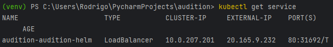

# audition

This is an application to process logs in order to evaluate quality control for 365-Widgets home sensors. As of now, it supports thermometers and humidistats. 
It exposes an API through which it is possible to send a file to be processed.
It is recommended to send .log files. The log file should have the following structure, in order to be able to process and do the necessary calculations:

```commandline
reference 70.0 45.0
thermometer temp-1
2007-04-05T22:00 72.4
2007-04-05T22:01 76.0
2007-04-05T22:02 79.1
2007-04-05T22:03 75.6
2007-04-05T22:04 71.2
2007-04-05T22:05 71.4
2007-04-05T22:06 69.2
2007-04-05T22:07 65.2
2007-04-05T22:08 62.8
2007-04-05T22:09 61.4
2007-04-05T22:10 64.0
2007-04-05T22:11 67.5
2007-04-05T22:12 69.4
thermometer temp-2
2007-04-05T22:01 69.5
2007-04-05T22:02 70.1
2007-04-05T22:03 71.3
2007-04-05T22:04 71.5
2007-04-05T22:05 69.8
humidity hum-1
2007-04-05T22:04 45.2
2007-04-05T22:05 45.3
2007-04-05T22:06 45.1
humidity hum-2
2007-04-05T22:04 44.4
2007-04-05T22:05 43.9
2007-04-05T22:06 44.9
2007-04-05T22:07 43.8
2007-04-05T22:08 42.1
```

The first line must contain the reference values for temperature and humidity, respectively, following the pattern ```reference <temperature> <humidity>```.\
The other lines may follow two kinds of patterns:
- State that a measure is starting, using the pattern ```<sensor-type> <sensor-name>```, where ```<sensor-type>``` should always be **thermometer** or **humidity**, so they can always go through their own quality control standard and ```<sensor-name>``` must start with **temp** or **hum**, as a good practice
- Contain a measure from one sensor, using the pattern ```<timestamp> <value>```.

The application will then return a JSON object containing the results of quality control, based on the values for each sensor. Here's an example:

```json
{
  "temp-1": "precise",
  "temp-2": "ultra precise",
  "hum-1": "keep",
  "hum-2": "discard"
}
```

### Running the application locally

To run this application locally, it is required:
- Python 3.8
- PIP

1. From terminal, clone the repo:

````commandline
git clone https://github.com/rodrigoorf/audition
cd audition
````

2. Install the required dependencies:

````commandline
pip install requirements.txt
````

3. Start the server using the following command:
````commandline
uvicorn src.main:app 
````

The application will start after a few seconds. When it's started, open your favorite browser and navigate to http://127.0.0.1:8000/docs. You can then try to access the api and understand how to use it on Swagger.

### Running the application inside a container

To run this application inside a container, it is required:

- Docker engine (Docker, colima, etc.)

1. After cloning the repo, generate an image:

````commandline
docker build -t audition .
````

2. Run the container:

````commandline
docker run -d --name audition -p 80:80 audition
````

Then, the application will be reachable from http://localhost/docs.

### Running the application in Azure Kubernetes Service

To run the application in an AKS cluster, it is required:

- Docker engine (Docker, colima, etc.)
- A valid Azure subscription
- Terraform CLI
- Azure CLI
- Helm

1. Authenticate into Azure CLI:

````commandline
az login
````

2. Open the directory that contains the Terraform resources to be provisioned, and hit apply:

````commandline
cd infra
terraform apply
````

This will provision a resource group, containing an AKS cluster (along with its resources), an Azure Container Registry and a role assignment between AKS and ACR, so the cluster can pull images from the ACR repository. 
3. Build the application image using the following command:

````commandline
az acr build --image audition:v1 --registry rodrigofreacr --file Dockerfile .
````

This will build and push the application image to the ACR repository.

4. Install the AKS CLI and connect to the AKS cluster:

````commandline
az aks install-cli
az aks get-credentials --resource-group Rg-aks-resource-group --name rodrigok8s
````

This will include the cluster context in the command line, so it is possible to run commands in the cluster, like deploying the application.

5. Run the following command to deploy the application within the cluster:

````commandline
cd audition-helm
helm install audition audition-helm
````

6. After deploying, run the following command to figure out the external IP for the application:

````commandline
kubectl get service audition-audition-helm
````

7. Copy the IP address inside the column **EXTERNAL-IP**, like the following example:



8. Open a browser and try to reach the application using the external IP address. Following the example from the image, this would be http://20.165.9.232/docs.

